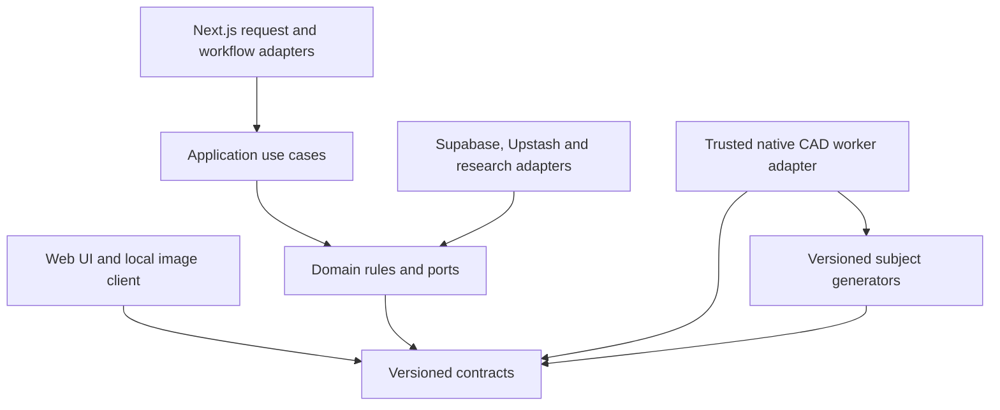
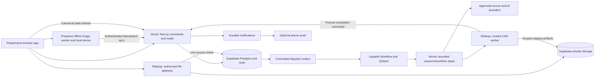
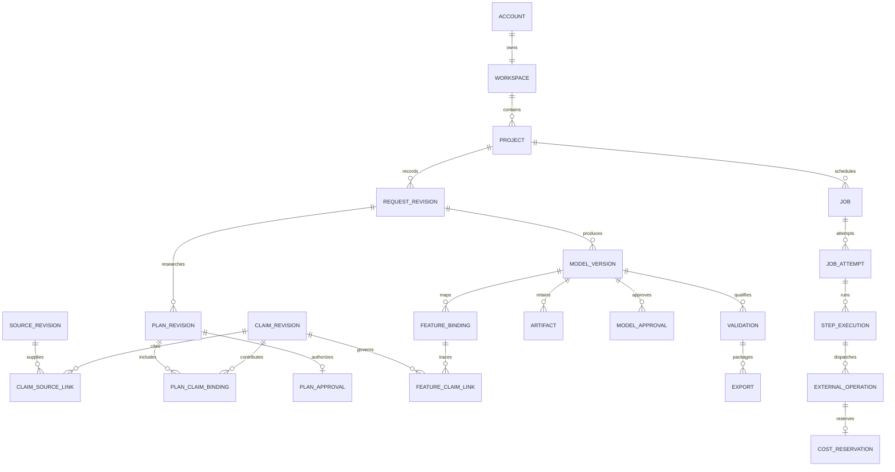

# Architecture Spine — nova3D

This is the implementation contract for independently built features. Josh ratified all fast-path choices on 2026-09-14. `[ADOPTED]` marks the resulting binding decisions; [RATIFIED-DECISIONS.md](RATIFIED-DECISIONS.md) resolves the former assumptions and questions. Finalization and ratification do not certify unbuilt capabilities or pass the engineering verification gates below.

The approved August 30 UX changes supersede conflicting PRD scope: both picture workflows, offline direct conversion and complete phone support belong to the first version. Research-assisted picture reconstruction remains online-only; offline execution applies only to direct image-derived conversion. The September 14 ratification record additionally resolves offline authority, direct-image recovery and visual-direction defaults. Other PRD requirements remain binding. PRD decision-register IDs are cited as **PRD:AD-1–PRD:AD-7**; they are not the architecture decisions numbered below. No parent architecture spine or application implementation exists.

## Design Paradigm

**Modular monolith with hexagonal boundaries:** one business application, modules with explicit ownership, and adapters for web UI, persistence, providers and isolated computation. Domain packages contain the subject-specific evidence rules and trusted geometry generators; the initial package covers the Middot altar and ramp. The cloud application and local image workflow share versioned contracts, not authority.

Dependency arrows mean “may import or implement contracts from.” Provider SDKs cannot be imported by domain rules.



## Invariants & Rules

### AD-1 — Module and execution boundaries [ADOPTED]

- **Binds:** All features; FR-8–FR-29.
- **Prevents:** Provider coupling, Temple rules scattered across features, and workers becoming a second business authority.
- **Rule:** Next.js owns web delivery and application commands. Isolated native workers execute trusted geometry, validation and export operations. Research adapters acquire and propose evidence; only application rules may accept it. UI and workers cannot grant approvals, change allowances or promote results directly. Cross-module access uses exported use cases/contracts; a module does not modify another module's tables. Do not execute model-authored scripts, shell commands or arbitrary Python.

### AD-2 — One durable authority and transactional mutation [ADOPTED]

- **Binds:** Accounts, Projects, research, geometry, Jobs, costs and exports.
- **Prevents:** Conflicting state owners and partially committed approvals, Jobs or artifacts.
- **Rule:** Supabase Postgres owns online business state. The ownership table below assigns each record family exactly one module. Public mutation routes invoke narrow transactional commands; sensitive tables have no browser DML grants. Commands validate authentication, ownership, schema, idempotency and expected revision, then commit state changes and outbox events together. Foreign keys include ownership scope where needed to prevent linking another Workspace's records. Redis, workflow history, browser state and notifications cannot authorize business transitions. Read paths enforce the same live authorization as commands.

### AD-3 — Workflow mode and approval identity [ADOPTED]

- **Binds:** FR-5, FR-10–FR-17, FR-23, FR-29; SC-1, SC-2.
- **Prevents:** Image-derived output acquiring historical authority or stale approval authorizing changed geometry.
- **Rule:** Each immutable request revision has mode `evidence_text`, `evidence_images` or `image_direct`. Modes `evidence_text` and `evidence_images` require complete research, resolved choices and Plan Approval of the exact plan digest before generation. Direct mode pins confirmed scope, ordered input-image digests and acknowledged coverage warnings; it is labelled image-derived and not historically verified. Converting modes creates a successor request and repeats the applicable gates. Every qualified export requires Model Approval of exact model content and compatible validation. Changing plan inputs, personalization or consequential geometry requires successor records and the applicable renewed approval. Approval is an authenticated command, never a client boolean.

### AD-4 — Immutable, bidirectional provenance [ADOPTED]

- **Binds:** FR-8–FR-22, FR-29, FR-30; NFR-3; PRD:AD-4.
- **Prevents:** Untraceable geometry, citations that change under approved work, and independently invented export schemas.
- **Rule:** Preserve typed immutable links `SourceRevision → ClaimRevision → Detail/Option → PlanRevision/PlanApproval → Parameter → Feature → ModelVersion → ModelApproval/Validation → Export`. Every source reference pins edition/revision, passage, retrieval time and allowed excerpt or digest. Preserve selected and rejected interpretations, explicit `sourced|inferred|disputed|unknown|user_added` status and source-based confidence explanation. Logical feature IDs survive regeneration; version-specific bindings map each feature to parameters, claims and geometry. Reverse navigation is computed from those same links. Image-derived features point to input images and inference activity without invented historical claims. Personalization remains user-added. The structured provenance envelope below is the only Source Record input; PDF rendering cannot author evidence.

### AD-5 — Research completeness and source eligibility [ADOPTED]

- **Binds:** FR-8–FR-14, FR-20; SC-6.
- **Prevents:** Approving incomplete work, using rejected evidence and treating retrieved instructions as authority.
- **Rule:** The domain package supplies a finite checklist covering shape, dimensions, materials, placement, printability and interpretation. Research must account for every item and record an independent omission-review pass with no unresolved gap. Middot chapter 3 governs the altar/ramp spatial model; lower-authority pages remain leads. Confirm subject/scope before research settings; record free/paid and reuse/fresh choices independently. Project exclusions and Account source toggles refer to stable source identity, covering its revisions. During active research, exclusion increments the effective evidence-policy epoch, invalidates affected draft claims/choices and continues replacement research. Completion commits only against the current epoch. Completed approved records never mutate: a Project correction opens a successor plan; an Account toggle adds a warning whose visibility preference cannot alter provenance. Source text and uploads are untrusted data; acquisition restricts outbound destinations, redirects, sizes and content types, and cannot reach private networks or credentials. Provider output is schema-validated and citation-checked before acceptance.

### AD-6 — Canonical geometry is a reproducible recipe [ADOPTED]

- **Binds:** FR-15–FR-17, FR-21, FR-22; NFR-6; PRD:AD-1, PRD:AD-2.
- **Prevents:** Probabilistic meshes becoming authoritative historical geometry and CAD snapshots losing regeneration history.
- **Rule:** Evidence-backed canonical input is a versioned declarative geometry recipe: approved typed parameters, source-unit conversions, operation/dependency graph, stable feature IDs and trusted generator identity. A pinned CadQuery worker produces solids. Each Model Version retains this recipe, generator and dependency-lock digests, execution settings, BREP/STEP snapshot and artifact manifest. STEP alone is not the parametric source. Models may propose data only within the trusted generator's validated schema; unsupported geometry requires extending that generator through code review. Fixed recipes must pass the ratified geometric-equivalence suite before generation is production-ready. Direct-image inference instead retains immutable mesh snapshots, exact model-bundle/input digests and settings; rerunning inference is a new candidate, with no deterministic reconstruction claim.

### AD-7 — Geometry identity, scale and viewing representations [ADOPTED]

- **Binds:** FR-18–FR-22; NFR-7, NFR-10; PRD:AD-2, PRD:AD-5.
- **Prevents:** Scale errors, triangle-index evidence links and preview degradation changing manufacturing data.
- **Rule:** Canonical geometry uses millimetres, right-handed coordinates and Z-up. Source measurements retain original value/unit and the approved conversion; historical unit choices belong to the plan. GLB viewing derivatives explicitly transform millimetres to metres and Z-up to Y-up. Print scale is a separate versioned transform. Every preview LOD carries semantic feature bindings independent of vertex/triangle ordering. Measurements resolve to canonical geometry or labelled exact dimension records, not screen pixels. Corrections rebuild the dependency closure; unchanged features must remain equivalent within the ratified tolerance. Restore selects immutable historical content through a new history event and rechecks approval/profile validity. Inspection supports sectioning, isolation, comparison and standard views. GPU loss preserves data and provides feature/evidence/dimension lists and static views; it cannot report a successful 3D inspection benchmark.

### AD-8 — Profile-bound validation, repair and export [ADOPTED]

- **Binds:** FR-23–FR-29; NFR-11; PRD:AD-3.
- **Prevents:** Exporting against the wrong profile, approval surviving consequential repair, and endless automatic regeneration.
- **Rule:** Validation identity includes model content, target-profile revision, physical scale, orientation, tessellation settings and validator version. Its checks report `pass|warning|fail|unknown`; unknown or unsupported required checks block qualified export. The initial fixture is A1 mini, 0.4 mm nozzle, gold silk PLA and at most 90 × 90 × 90 mm. R-3 fixes the initial filament, profile, threshold and permitted-repair contract; implementations must produce its qualification evidence. Repair produces a recorded derivative and reruns validation. Changes to visible geometry, historical dimensions or personalization create a new Model Version requiring renewed inspection and Model Approval; other repairs require recorded nonconsequential-equivalence verification. Permit at most one full constrained regeneration for a validation-attempt lineage, including its repair children. Manufacturing consumes R-11's unique lineage slot atomically with dispatch; no child, failure or retry resets it. Evidence mode regenerates from the approved plan; direct mode follows R-11's pinned-image reconversion into a newly inspected and approved Model Version, never a synthetic Research Plan. This exception to ordinary manual retry remains within paid permission and reserved cost; unresolved interpretation changes return to Plan Approval. Export packages contain primary 3MF, optional STL, readable PDF Source Record and structured provenance, all bound to immutable digests.

### AD-9 — Durable jobs and explicit retry semantics [ADOPTED]

- **Binds:** FR-6, FR-7; NFR-4, NFR-8.
- **Prevents:** Lost accepted work, duplicate execution and silent retries of failed research/generation.
- **Rule:** A Job is accepted only after its record and dispatch outbox event commit. Upstash Workflow orchestrates short HTTP steps and external-worker completion; it does not hold authoritative state. Persist each step's execution identity and result before advancing. Public Job states are `waiting|running|completed|failed|cancelled`, with explicit stage and waiting/failure reason. Configure failed research/generation execution for zero automatic retries and handle a failure by committing a terminal outcome; user retry creates a new linked attempt. Transport redelivery may reconcile an already accepted operation, but may not re-execute failed work or issue an uncertain external charge again. Leased worker loss produces an interrupted failure requiring user action. Pending unclaimed dispatch can be redelivered safely. Every failure preserves the last approved version and reports stage, known cause, cost status and permitted next action.

### AD-10 — Fenced commits and cancellation [ADOPTED]

- **Binds:** FR-3, FR-6, FR-20, FR-30; NFR-5.
- **Prevents:** Late writes, stale source acceptance and work resurrecting deleted or disabled state.
- **Rule:** Every worker attempt carries Job ID, unique attempt/fencing token, immutable input digest, expected Project revision, Account authorization epoch and relevant evidence-policy epoch. Claim and commit commands check live ownership, status, tombstones, lease and epochs. Output stages under an attempt-scoped manifest and becomes visible only through a successful transactional commit. Cancel/disable/delete revokes commit authority first, then signals best-effort provider/process cancellation. No new external step may start after revocation; already-submitted external work may incur a reconciled cost but its result cannot publish. Cancellation clears or expires staging data. A newer Project revision wins; rejected results never overwrite it.

### AD-11 — Permission and money share a transaction boundary [ADOPTED]

- **Binds:** FR-4, FR-14; NFR-9; PRD:AD-6.
- **Prevents:** Concurrent overspend, duplicate charges and resets making unsettled work disappear.
- **Rule:** Before each billable external operation, match Project permission to category, provider, purpose, outbound-data categories and disclosed maximum. Atomically reserve its enforceable upper cost bound against settled usage plus all outstanding reservations. Store integer money amounts in one configured ledger currency and immutable ledger entries. Persist provider operation/idempotency identity before dispatch; reconcile uncertain outcomes without issuing a replacement charge. Cancellation releases only demonstrably unused allowance; unresolved charges retain their reservation. Budget resets create a new allowance period while carrying outstanding liabilities; they never rewrite settlements. A provider with no enforceable maximum or reconcilable uncertain outcome cannot be enabled for paid Jobs. Running authorized Jobs retain their existing reservation when a limit is reached; Account disable still cancels them. Free-only research cannot invoke a billable research operation; R-6 fixes USD ledger units, provider/category permission defaults, hard budgets and instance-overhead categorization.

### AD-12 — Controlled identity and live authorization [ADOPTED]

- **Binds:** FR-1–FR-4, FR-30; NFR-1, NFR-2.
- **Prevents:** Invitation races, continued access through valid JWTs and Administrator access to private workspaces.
- **Rule:** Disable public Supabase sign-up. One narrow registration service atomically claims a hashed invitation and idempotently provisions Auth identity plus Workspace; partial provisioning is unusable until activation completes. Codes have no time expiry, are single-use/revocable, and the shareable code rotates only after successful registration. Rate-limit attempts; never return codes in logs. Every private request verifies JWT plus a live active Account and non-revoked session grant tied to its session identity. Database row policies and controlled storage access enforce this boundary even if a browser bypasses the UI. Disable revokes session grants and worker authority immediately. Administrator capabilities are invitation management, Account status, usage/limit administration and instance closure; no impersonation or private Project reads. Recovery uses a short-lived single-use verified-email link and revokes previous Administrator sessions. Sensitive administration, deletion and instance closure require fresh authentication and append-only audit events. Ordinary Administrator self-deletion is blocked while invitees exist; close-instance applies the adopted global deletion procedure.

### AD-13 — Private artifacts and revocable delivery [ADOPTED]

- **Binds:** Uploads, Models, Versions, Exports; FR-3, FR-22, FR-30.
- **Prevents:** Private URLs outliving access revocation and incomplete file writes becoming restorable Versions.
- **Rule:** Supabase Storage buckets are private. Artifacts use ownership-scoped immutable keys, content digests, sizes and committed manifests. Only a committed, verified manifest can be presented as usable/restorable. Large uploads stream into quota-limited staging through an authenticated gateway and attach only after ownership, content and checksum validation. The same gateway streams downloads and range requests with live Account/session/Project checks; it exposes no reusable storage signed download URL. Gateway access is rechecked between bounded chunks and stops on revocation. Private responses use `no-store`; service credentials stay server-side. Previously downloaded bytes cannot be recalled. Orphan cleanup observes active upload/worker leases before removing staging. Use the container runtime for large transfer paths so Vercel payload limits do not constrain model files.

### AD-14 — Public research reuse without private history [ADOPTED]

- **Binds:** FR-8, FR-9, FR-14, FR-30; NFR-12; PRD:AD-7.
- **Prevents:** Cache promotion preserving uploads, personalized decisions or another Account's activity.
- **Rule:** Cache promotion accepts a dedicated allowlisted public-source record, never a serialized Project/plan. It includes only source-derived claims, normalized public subject, immutable source identities and permitted provenance. Exclude Account IDs, request/usage links, private wording, uploads, personalization, approvals and geometry. Private adoption associations remain Workspace-owned and are deleted with it. Admission verifies reproducibility from identified non-private sources, content-retention policy and live non-tombstoned originating work. Cache records are immutable; corrections are successor revisions. Reuse is an explicit Project choice, preserves original dates and never implies automatic re-verification. Source exclusions still filter reuse. Selecting fresh research prevents substituting cached conclusions, though public source identity may be deduplicated.

### AD-15 — Deletion survives restoration [ADOPTED]

- **Binds:** FR-30; NFR-7, NFR-12.
- **Prevents:** Restoration resurrecting deleted data and overlooked storage/log copies violating deletion.
- **Rule:** Tombstone and hide the target before revoking access, cancelling Jobs and purging. A deletion manifest covers database records, images, model artifacts, exports, staging, notifications, private usage associations, local operational traces and backups. Active private copies are purged promptly; all controlled backup copies expire or are removed within 30 days of deletion. A restricted deletion ledger outside database restore rollback records opaque target identities and is replayed before any restored service opens access. Backup storage objects independently of database metadata; prove restoration of each referenced artifact and tombstone enforcement. Immutable records are immutable during ordinary operation, not exempt from deletion. Retain no identifiable deleted-user audit or billing history contrary to FR-30; only nonidentifying aggregates and the minimum anti-resurrection ledger may remain. Disclose external-provider retention limitations before data transfer. R-8 adopts revocation on reconnect for already-local data, with no disconnected lifetime bound; cloud revocation remains immediate. Disconnected devices and user-downloaded copies are outside controlled-backup erasure guarantees.

### AD-16 — Offline image work and conflict-safe synchronization [ADOPTED]

- **Binds:** SC-1–SC-3; NFR-1, NFR-5, NFR-7; G-8.
- **Prevents:** Cloud dependence disguised as offline conversion, cross-account local leakage and sync overwrites.
- **Rule:** A prepared client caches the app and verified inference bundle, runs direct conversion in a dedicated worker, and stores Account-scoped metadata in IndexedDB with binary artifacts in OPFS. Local creation accepts ordered multi-view images, camera input, clarity/coverage results and acknowledged uncertainty. Each local request, model and sync command has a stable UUID; device timestamps never decide the server winner. Sync authenticates the original Account, checks disable/deletion and expected parent revision, verifies artifacts, and commits an idempotent import. Conflicts retain both versions and require explicit current-version selection; duplicate sync cannot duplicate Projects. Local evidence/approval labels are untrusted; qualified export follows online server gates. Show unsynced, syncing, failed and conflict states. Service workers cache public app/model assets only, not arbitrary authenticated responses. Explicit sign-out clears private local stores; account switching never attaches another Account's drafts. Storage availability, interrupted execution and missing preparation have explicit recoverable outcomes. No automatic upload or paid cloud fallback on inference failure. R-8 fixes preparation, reconnect revocation and local retention; R-5 fixes qualification devices. Engine quality, storage and revocation implementation must pass G-8 before release. A known disable remains locked until authoritative re-enable.

### AD-17 — Equivalent accessible, localized capabilities [ADOPTED]

- **Binds:** SC-3, SC-4, SC-7; FR-18, FR-19.
- **Prevents:** Phone or screen-reader users losing the approval/evidence workflow and translations replacing source text.
- **Rule:** Phone, laptop and desktop expose the same workflow capabilities. Store original source, translation and explanation separately with language/direction metadata. Configured locale catalogs govern UI text; choose a supported device-language match initially, with persistent Account override. Layout uses logical directions and isolated bidirectional source spans. Light is the default; dark is an explicit preference. Technical-detail preference changes explanation depth only. All inspection/evidence actions have labelled keyboard and screen-reader controls, a semantic feature list, visible focus, non-colour statuses, text enlargement and reduced-motion behavior; target WCAG 2.2 AA. Canvas visuals supplement these controls. Guidance is dismissible and reopenable. R-10 fixes the visual direction; UX completes and verifies responsive layouts under that baseline.

### AD-18 — Notifications are durable history plus optional delivery [ADOPTED]

- **Binds:** FR-7; SC-5, SC-7.
- **Prevents:** Push failure erasing completion history or notification payloads leaking Project content.
- **Rule:** A committed domain event creates one durable in-app notification per recipient/event. Realtime/push delivery may duplicate or fail; clients deduplicate and refresh canonical state. The event carries an exact authorized target, and resolving its link rechecks current access. Push payloads contain opaque event references and generic category text, never private source excerpts, model names or images. Account preferences independently control research, generation, validation and export push; printing is inactive until implemented. Ask notification permission contextually and support required phone app-install steps. In-app history survives denied push. Research activity displays recorded sources and acquisition/acceptance stages, not invented hidden reasoning; reading a source does not pause its Job.

### AD-19 — Environment and operational boundaries [ADOPTED]

- **Binds:** All deployed components; NFR-2, NFR-4, NFR-7, NFR-12.
- **Prevents:** Production work from previews, incompatible worker rollouts and invisible deletion/reconciliation failures.
- **Rule:** Keep one repository and explicit local, staging and production environments with separate Supabase resources, queues, secrets, storage and callback domains. Deploy immutable worker images and versioned contracts; an incompatible worker refuses a Job rather than interpreting it approximately. Existing Jobs retain their compatible worker/toolchain until terminal. Pin transitive dependencies and image digests at bootstrap; subsequent code lockfiles own exact versions. Schema rollout is expand/migrate/contract; rollback cannot erase provenance, money or deletion history. Keep application/data/worker in a compatible primary-region layout and verify provider residency/retention before enabling private work. Preview environments use synthetic data and disabled paid adapters. Monitor outbox age, worker leases, failure rates, unknown costs, storage integrity and purge deadlines with redacted correlation IDs. Infrastructure outages fail authorization closed and preserve durable pending work; reconnects refresh from Postgres.

## Consistency Conventions

| Concern | Convention |
| --- | --- |
| IDs and versions | UUID logical identities; immutable revision IDs; SHA-256 artifact/content digests; UTC ISO-8601 timestamps; explicit schema version on cross-runtime payloads. |
| Commands | Auth-derived Account, command ID, expected revision, typed payload; immutable response receipt makes replay idempotent. Same ID with different payload is rejected. |
| Events | Stable event ID, event type/version, owning aggregate ID/revision and correlation ID. Queues contain minimal opaque references; private evidence stays in controlled storage. |
| Failures | Stable machine code, stage, ordinary-language message, preserved state, cost status and allowed action; no secrets, raw provider dumps or hidden prompts. |
| Geometry contracts | Finite typed values with explicit units, coordinate frame and transforms; reject nonfinite/ambiguous values and dependency cycles. |
| Network authority | Cookie mutations require origin/CSRF checks; worker callbacks require authenticated signatures/service identity plus replay and fencing checks. No anonymous job trigger. |
| Immutable records | Append successors and current-pointer events; only the controlled deletion path may purge them. |

Execution and deployment contracts also bind independently built adapters:

- **Delivery and retries:** Configure both workflow and explicit queue publishes for zero failed-work retries. Test the effective provider configuration with a deliberately failing research step. Regardless of transport behavior, database step receipts allow only one execution claim per attempt: a terminal failed/cancelled attempt cannot be reclaimed. A duplicate transport delivery returns its existing receipt; an ambiguous external outcome enters reconciliation without another side effect. Retry authorization is a new user-command identity, apart from AD-8's bounded repair lineage.
- **Service authentication:** Application-issued worker/gateway requests bind environment, audience, Job/attempt, payload digest, nonce and a maximum five-minute expiry to a versioned signing key; allow at most 60 seconds of clock skew. Provider-native callbacks use the official signature verifier and additionally match the stored environment/dispatch/attempt receipt. Replayed delivery may return the exact existing receipt but cannot repeat a mutation. Receivers accept only the active key and one explicitly retiring key for the outstanding-request window; suspected compromise revokes the key and affected leases immediately. No callback identity may be inferred from a Project ID alone.
- **File authorization:** Authorize each range and each chunk of at most 1 MiB against current session, Account, Project and artifact status. Never preauthorize the remaining stream after a check. Revocation prevents further chunk authorization; bytes already delivered or in flight are not retractable. Cache neither the authorization decision across chunks nor the private response.
- **Environment enforcement:** Every deployment has an immutable environment/instance identifier. CI and startup verify it against the configured database, queue and allowed callback origin, rejecting mixed configurations. Messages and worker registrations carry that identifier; command handlers reject a mismatch. Production credentials are unavailable to preview builds, and preview paid adapters are hard-disabled rather than hidden by UI.
- **Contract evolution:** A Job pins command schema, result schema, generator version and worker-image digest at acceptance. Dispatch selects an explicitly registered compatible worker; no available match leaves the Job waiting with a reason. Additive minor schema changes remain compatible only where declared and validated; a major change gets a separate worker/endpoint. Deploy consumers before producers, retain old consumers until their Jobs terminate, and retain generator images/locks needed by every non-deleted reproducible Version. Never resume a pinned Job against a silently upgraded generator.

The following shared identities are mandatory parts of the contract package. The ratified record additionally binds one cost calculator and parent-Job budget (R-6), one comparison frame (R-2), monotonic local revocation state (R-8) and an atomically consumed full-regeneration slot (R-11):

- **Artifact authority:** The Artifacts module owns one `ArtifactManifest` record family in Postgres. A committed manifest has immutable ID, ownership scope, producing activity, content kind, byte digest/length, canonical serialization version and child-artifact references. Its canonical JSON digest is the manifest root; object-store keys and secondary indexes cannot redefine it. Model Versions and export records reference these roots. Approval, gateway access, restore, cleanup and deletion resolve the same roots. Staging/upload leases are separate mutable records. Only the coordinated artifact-publication command can attach a verified manifest to its owning aggregate.
- **Repair identity:** Every repaired byte representation receives a new artifact ID/digest. Model Approval binds Model Version ID plus canonical geometry/recipe-or-snapshot digest. A nonconsequential print-mesh repair may retain that Model Version only with a recorded, ratified equivalence check linking the approved canonical content to the repaired artifact. Export binds the approved version, repaired artifact, equivalence proof and rerun validation together. A consequential change creates a successor Model Version and invalidates approval for that successor. Reclassifying a repair to avoid approval is forbidden; G-3 defines the allowed operations/checks.
- **Evidence policy identity:** Each research attempt, private cache-adoption record and Plan Revision pins the effective Account-source-policy revision and Project-exclusion revision plus their explicit source identity set. Filtering is deterministic for those inputs. The plan digest includes that policy snapshot. Active-research policy changes create a successor draft and rerun affected conclusions and the completeness gate before approval. A completed approved plan retains its original policy snapshot; an Account toggle adds its adopted warning, while a Project correction needs a newly approved successor plan. Private exclusion/adoption information never enters public cache records.
- **Work and billing identity:** Jobs own the hierarchy `Job → JobAttempt → StepExecution → ExternalOperation`. User retry creates a new JobAttempt under the same Job; attempts pin their own inputs/toolchain and cannot mutate earlier attempts. A StepExecution is unique by attempt and logical step key; an ExternalOperation is unique by step and operation ordinal. Jobs owns the operation receipt/state; Usage owns the reservation/ledger entries keyed to that operation ID. These records commit together before first dispatch. An ambiguous operation is reconciled under its existing identity and never superseded by an automatic retry. A requested new attempt waits until the prior potentially chargeable operation is terminal/reconciled; no allowance reset or attempt-number change bypasses that constraint. Fencing always checks the operation's parent attempt.
- **Offline rejection:** Every sync/import rechecks live Account and Project status before attaching anything. A disabled or tombstoned Account or tombstoned Project cannot import local work. On learning an Account disable, the client stops work/sync and locks private stores; on learning an Account tombstone it purges all of that Account's private stores and pending commands. A Project tombstone purges that Project's local artifacts/commands. Network/authentication uncertainty does not masquerade as a tombstone and cannot cause silent local data loss; R-8 permits already-local use during that uncertainty, except that a previously learned disable remains locked until authoritative re-enable. Deleted IDs can never be reused to create a new Project.

The versioned structured provenance envelope has these required semantic groups. The contract package owns exact JSON fields and generates TypeScript/Python validators together before export work; features may not invent competing formats.

| Group | Required identity and relationships |
| --- | --- |
| Header | Schema version, request mode, Project/Model Version, export identity and creation activity. |
| Evidence | Source revisions with passage/content pins; claims; classifications; competing options; explanations; original/translated text distinction. |
| Approvals | Exact plan/model digests, approver/time, choices and affected details; direct-mode scope/uncertainty acknowledgment where applicable. |
| Geometry | Canonical recipe or image-derived snapshot kind, units/conversions, feature/parameter/dependency links and artifact digests. |
| Manufacturing | Target profile, scale/orientation, validator/tool versions, each check result, repairs, regenerated versions and qualified export manifest. |

## Stack

Seed choices are ratified by R-1. Registry versions were verified on 2026-09-14; the adopted bootstrap baseline now has isolated installation/build and native-worker evidence in the [qualification report](../../../implementation-artifacts/qualification-2026-09-14/REPORT.md). These probes do not qualify the application or deployed infrastructure. Managed platforms do not have an application-pinnable release number.

| Name | Version | Responsibility |
| --- | --- | --- |
| Node.js | 24.21.0 LTS | Web development/runtime baseline; managed Vercel patch follows its supported Node 24 runtime. |
| create-next-app / Next.js | 16.3.5 | Official App Router starter and Vercel web application. |
| React / React DOM | 19.3.0 | Interactive browser UI. |
| TypeScript | 5.9.3 | Typed application/contracts baseline; a TypeScript 7 upgrade is not required for the first build. |
| Tailwind CSS | 4.3.3 | Responsive, localized interface styling. |
| Supabase | Managed service, verified 2026-09-14 | Postgres, Auth, private Storage and optional realtime hints. Record actual database major at provisioning. |
| @supabase/supabase-js / @supabase/ssr | 2.116.0 / 0.12.7 | Supported browser/server Auth and data adapters. |
| Upstash Workflow / QStash | @upstash/workflow 1.3.3; managed QStash | Durable orchestration and dispatch. |
| Upstash Redis | @upstash/redis 1.38.4; managed Redis | Rate limiting and disposable coordination/cache only. |
| Three.js | 0.186.0 | GLB-based inspection with WebGL2; semantic controls remain outside the canvas. |
| CadQuery | 2.8.0; Python 3.12 release line | Native trusted solid generation/export; exact maintained Python patch/OCP/image closure selected and verified in G-1. |
| Railway | Managed Docker deployment, verified 2026-09-14 | CAD worker and authenticated large-artifact gateway. |
| Vercel | Managed platform, verified 2026-09-14 | Next.js delivery and bounded application/workflow endpoints. |

Bootstrap from the official current Next.js TypeScript/App Router/Tailwind starter, then apply the documented Supabase SSR integration. The inspected `with-supabase` example mixes current dependency selectors with Tailwind 3 and older lint pins; do not copy those pins into this Tailwind 4 seed. Bootstrap must install, typecheck and build the chosen package set before adopting its lockfile. Python 3.12 is the adopted conservative worker baseline: CadQuery documentation and OCP wheel metadata disagree on the newest supported Python, so do not interpret CadQuery's lower bound as proof of arbitrary newer-runtime compatibility. No app dependencies were changed by this architecture task.

## Structural Seed

Runtime arrows show data/control flow, not imports.



| Module | Sole owned record families |
| --- | --- |
| Identity | Account status, session grants, invitations/redemptions, admin capabilities, recovery audit. |
| Projects | Workspace/Project, request revisions, personalization, history/current pointers and Project exclusions. |
| Evidence | Sources/revisions, draft and immutable claims, detail checklists, options, plans, Plan Approvals and public cache revisions. |
| Geometry | Recipes, feature/dependency bindings, Model Versions and Model Approvals, referencing artifact roots. |
| Manufacturing | Print profiles, validation/repair lineages and export/provenance records, referencing artifact roots. |
| Artifacts | Canonical ArtifactManifest records, immutable content roots, staging/uploads and attachment publication. |
| Jobs | Jobs, attempts, step/external-operation receipts, leases, dispatch outbox and execution events. |
| Usage | Paid permissions, reservations, immutable settlements, allowance periods and provider reconciliation. |
| Preferences/notifications | Account source toggles, locale/theme/detail preferences, notification history and push subscriptions. |
| Lifecycle | Tombstones, deletion manifests, cleanup progress and restore-exclusion ledger. |

Modules participate in one coordinated database transaction when an invariant spans ownership boundaries; ownership does not require distributed transactions. In particular, accepting paid work spans Usage, Jobs and Project revision checks.



```text
apps/web/                 Next.js UI, authenticated routes and workflow adapters
packages/contracts/      Cross-runtime schemas, generated types and fixtures
packages/domain/         Business rules and provider-neutral ports
packages/application/    Commands and orchestration policies
packages/adapters/       Supabase, Upstash, acquisition and provider integrations
packages/domains/middot/  Evidence checklist and trusted altar/ramp generator contract
workers/cad/             Native generator, validation and export container
workers/files/           Live-authorized artifact streaming gateway
supabase/                Ordered migrations, policies and local seed fixtures
tests/contracts/         Ownership, approval, race, provenance and artifact fixtures
```

Start with this small workspace layout; no monorepo orchestration product is required. Worker/gateway may share one managed service initially if each keeps bounded resources, separate process permissions and independent request authentication. Production, staging and local resources are separate; production queue endpoints never point to ephemeral preview deployments. Backups include both database state and binary artifacts, with a separate restore-exclusion ledger.

## Capability → Architecture Map

| Requirements | Responsible areas | Governing decisions |
| --- | --- | --- |
| FR-1–FR-4 | Identity, Usage, Lifecycle | AD-2, AD-10–AD-13, AD-15 |
| FR-5–FR-7 | Projects, Jobs, notifications | AD-3, AD-9–AD-11, AD-18 |
| FR-8–FR-14 | Evidence, acquisition, Usage | AD-3–AD-5, AD-11, AD-14 |
| FR-15–FR-17 | Geometry and subject package | AD-3, AD-4, AD-6 |
| FR-18–FR-22 | Viewer, Geometry, Evidence | AD-4, AD-6, AD-7, AD-17 |
| FR-23–FR-29 | Geometry approvals, Manufacturing | AD-3, AD-4, AD-8, AD-13 |
| FR-30 | Lifecycle and all record owners | AD-10, AD-12–AD-16 |
| SC-1–SC-3 | Picture intake, offline client, sync, full phone workflow | AD-3, AD-6, AD-7, AD-16, AD-17 |
| SC-4–SC-7 | Localization, preferences, notifications, source eligibility | AD-5, AD-17, AD-18 |
| NFR-1–NFR-5 | Authorization, provenance, jobs and safe concurrency | AD-2, AD-4, AD-9, AD-10, AD-12–AD-16, AD-19 |
| NFR-6–NFR-8 | Reproducibility, restore and explainable failure | AD-6, AD-7, AD-9, AD-13, AD-15 |
| NFR-9–NFR-12 | Cost, responsiveness, validation, privacy | AD-8, AD-11, AD-14–AD-19 |

## Deferred and Implementation Gates

All product ratifications are complete under [RATIFIED-DECISIONS.md](RATIFIED-DECISIONS.md). R-1–R-11 are binding; G-1–G-9 now track engineering evidence only. Implementation and qualification work may proceed. Affected capability acceptance and full first-version release require the applicable checks; no provider account or benchmark was exercised by ratification. The subsequent [qualification run](../../../implementation-artifacts/qualification-2026-09-14/REPORT.md) provides scoped local evidence; every full application gate remains open.

| Gate | Adopted baseline | Status | Evidence and remaining work |
| --- | --- | --- | --- |
| G-1 | R-1 | PARTIAL | Synthetic native generation/correction/restore/cancellation passed. Complete the approved corpus and deployed application worker. |
| G-2 | R-2 | PARTIAL | Coarse comparisons passed. Certified surface-distance/error bounds and final-print correspondence remain unimplemented. |
| G-3 | R-3, R-11 | PARTIAL | Profile closure, three-perimeter override, fixtures and one BambuStudio slice passed. General validation/support, repair and lineage integration remain unimplemented. |
| G-4 | R-4 | NOT RUN | Cross-runtime schema, linked immutable export and bilingual PDF remain unrun. |
| G-5 | R-5, R-10 | BLOCKED | Headless Linux API/storage probes passed. Real named devices, viewer timing, accessibility and GPU-loss recovery remain unqualified. |
| G-6 | R-6 | PARTIAL | Local integer budget/concurrency probes passed. Provider terms, permission enforcement and ambiguous-charge reconciliation remain unqualified. |
| G-7 | R-7 | NOT RUN | Exact edition/rights ingestion and permitted retention paths remain unrun. |
| G-8 | R-8, R-11 | BLOCKED | Storage/runtime primitives passed. No reviewed reconstruction model meets the adopted phone target; offline inference, device quality and authoritative sync remain unqualified. |
| G-9 | R-9 | PARTIAL | Local database/object restore with intervening deletion passed. Full app/cloud restore, live fencing, retention and RPO/RTO remain unqualified. |

R-4 additionally seeds Playwright 1.63.0/Chromium and provenance schema 1.0.0 (JSON Schema Draft 2020-12); R-8 seeds ONNX Runtime Web 1.29.0. R-6 fixes research provider selection and permission/cost contracts; R-3 fixes the initial print profile; R-5/R-9 fix device and operations targets. Exact fonts, provider API/rate versions, model weights, runtime locks and deployed plans are pinned in implementation qualification records under those decisions. No working multi-view phone reconstruction model is claimed; a failed G-8 blocks full release.

Bootstrap acceptance records actual provider plans/regions, Vercel runtime/function limits, Supabase database/Auth/Storage/backup settings, Railway image/resources and Upstash placement. Exercise the cross-provider callback and private-file path in staging. A release containing all approved first-version capabilities requires every applicable gate to pass; a narrower release needs a product scope change.

Implementation verification must exercise actual seams: two-account access denial through APIs/storage, concurrent invitation redemption, replayed commands/callbacks, cancellation/delete-versus-result races, simultaneous cost reservations and uncertain charges, stale plan/model approval, source toggle during research, immutable-cache privacy, offline duplicate/conflict import, restoration after deletion, canonical-versus-preview transforms, accessible feature navigation and bilingual PDF provenance. Unit tests alone cannot establish these guarantees.

Deferred implementation details under these contracts: exact UI component library and layouts following R-10; trusted domain-generator internals; provider SDKs behind their ports; measured indexes; optional Redis caches; generated API field names; model/weight and compatible dependency selection that passes the adopted qualification gates. These choices cannot change ownership, approval identity, money, provenance, geometry, privacy or mode semantics. Printer fleet integration, whole-Temple expansion, other domains and commercial workflows retain their approved later sequence. Physical printing is not required for the altar/ramp milestone.

## Verification Sources

Checked 2026-09-14. These verify available capabilities and seed versions, not nova3D-specific performance.

- [Next.js installation and starter](https://nextjs.org/docs/app/getting-started/installation), [Supabase Next.js integration](https://supabase.com/docs/guides/getting-started/quickstarts/nextjs), [inspected Supabase starter manifest](https://github.com/vercel/next.js/blob/canary/examples/with-supabase/package.json), [Tailwind Next.js setup](https://tailwindcss.com/docs/installation/framework-guides/nextjs).
- [Vercel function limits](https://vercel.com/docs/functions/limitations): generally available execution/memory/payload bounds; extended durations and large bundles include beta features. [Railway Docker builds](https://docs.railway.com/builds/dockerfiles) establish the native-worker deployment path.
- [Upstash execution model](https://upstash.com/docs/workflow/basics/how), [retry configuration](https://upstash.com/docs/workflow/features/retries) and [flow control](https://upstash.com/docs/workflow/features/flow-control). Nova3D's database idempotency and failure rules remain necessary.
- [Supabase JWT sign-out limitation](https://supabase.com/docs/reference/javascript/auth-signout), [storage download authorization](https://supabase.com/docs/guides/storage/serving/downloads), [row-level security](https://supabase.com/docs/guides/database/postgres/row-level-security), [database backups](https://supabase.com/docs/guides/platform/backups).
- [CadQuery import/export](https://cadquery.readthedocs.io/en/stable/importexport.html), [CadQuery installation](https://cadquery.readthedocs.io/en/stable/installation.html), [OCP 7.9.3.1 metadata and wheels](https://pypi.org/pypi/cadquery-ocp/7.9.3.1/json), [KCL alternative](https://zoo.dev/docs/kcl), [Three.js renderer](https://threejs.org/docs/pages/WebGLRenderer.html), [W3C provenance model](https://www.w3.org/TR/prov-dm/).
- [ONNX browser inference](https://onnxruntime.ai/docs/tutorials/web/), [large-model restrictions](https://onnxruntime.ai/docs/tutorials/web/large-models.html), [OPFS](https://developer.mozilla.org/en-US/docs/Web/API/File_System_API/Origin_private_file_system), [IndexedDB](https://developer.mozilla.org/en-US/docs/Web/API/IndexedDB_API), [WCAG 2.2](https://www.w3.org/TR/WCAG22/), [iOS web push](https://webkit.org/blog/13878/web-push-for-web-apps-on-ios-and-ipados/), [A1 mini manufacturer specifications](https://us.store.bambulab.com/products/a1-mini).
- Version metadata: [Node releases](https://nodejs.org/dist/index.json), [Next.js](https://registry.npmjs.org/next/16.3.5), [React](https://registry.npmjs.org/react/19.3.0), [TypeScript](https://registry.npmjs.org/typescript/5.9.3), [Tailwind](https://registry.npmjs.org/tailwindcss/4.3.3), [Supabase JS](https://registry.npmjs.org/@supabase%2fsupabase-js/2.116.0), [Supabase SSR](https://registry.npmjs.org/@supabase%2fssr/0.12.7), [Upstash Workflow](https://registry.npmjs.org/@upstash%2fworkflow/1.3.3), [Upstash Redis](https://registry.npmjs.org/@upstash%2fredis/1.38.4), [Three.js](https://registry.npmjs.org/three/0.186.0), [CadQuery](https://pypi.org/pypi/cadquery/2.8.0/json).
